# Frequently Asked Questions (FAQ)

This document records common issues and solutions when using the MUSE Pi Pro development board, covering flashing, power supply, and WiFi connection scenarios.
---

## Flashing Issues

### Q: Unable to flash or flashing failed, what should I do?

**A:** Flashing issues need to be troubleshot in stages. Check in the following order:

---

### **Stage 1: Pre-flashing Preparation**

Before clicking the "Start Flashing" button, make sure the following preparations are complete:

#### Step 1: Put the board into flashing mode and connect it to the computer

<a id="step1-operation-steps"></a>
**Operation steps:**
1. Press and hold the **FDL** button (do not release)
2. While holding FDL, briefly press the **RST** (reset) button (the green LED will blink once)
3. Release FDL
4. Connect the board to the computer with a data cable

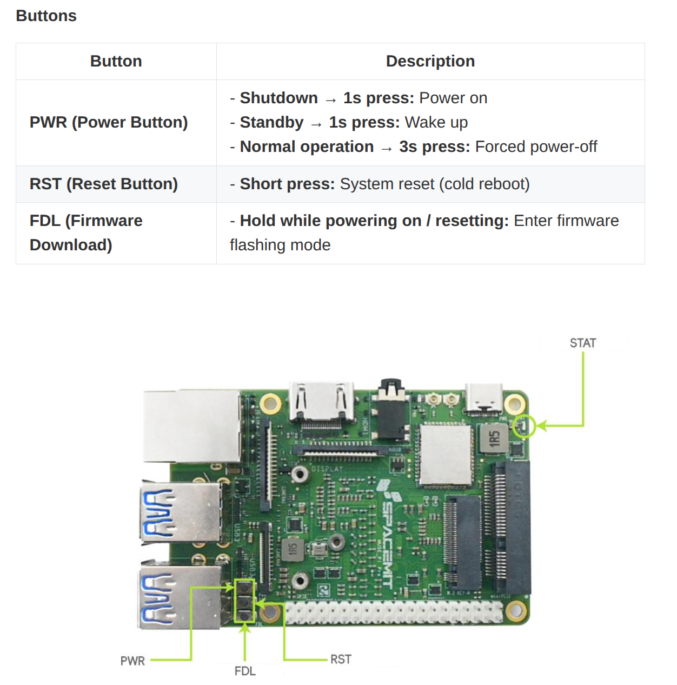

**How to verify that flashing mode was entered successfully:**

Verify using either of the following methods:

**Method 1: Use the Titan tool (recommended, most direct, works on both Windows and Linux)**
- Open the Titan tool and click "Refresh Device" or "Scan Device"
- If the device is recognized (shows a device serial number or "Connected" status) → Success

Example of a successful device scan (device list is not empty) shown below
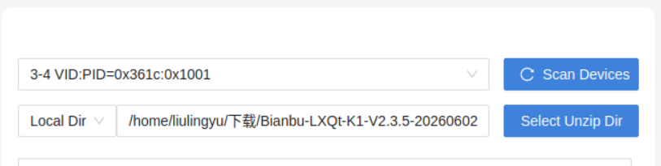

**Method 2: Verify using a system command**

**On Linux:**
```bash
lsusb
```
- If you see `DFU USB download gadget` → Success

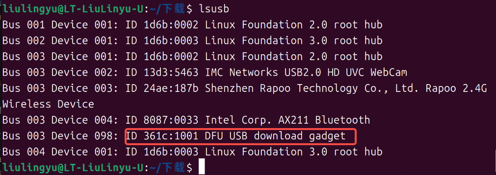

> **Note for Windows users**: Unlike Linux, Windows has no `lsusb` command, and Device Manager may not show the device due to driver issues. **It is recommended to use Method 1 (Titan tool) directly** — as long as Titan recognizes the device, flashing mode was entered successfully and you can proceed to flash normally.


**If the device is not recognized, troubleshoot in the following order:**

Example of a failed device scan (device list is empty) shown below
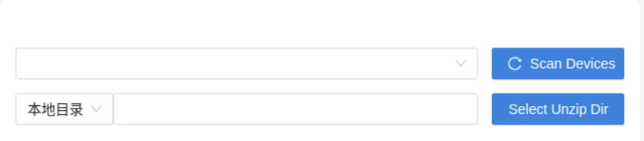

1. **Re-enter flashing mode**: Repeat the [operation steps above](#step1-operation-steps) (hold FDL + briefly press RST)

2. **Switch to a different USB port on the computer**: Prefer a port connected directly to the motherboard, and avoid USB hubs or docking stations

3. **Switch to a different data cable**: Use a cable **confirmed to support data transfer** (for example, one that can transfer files with a phone) and try again

4. **If none of the above works**: This may be a hardware fault — contact customer support

#### Step 2: Confirm that the downloaded image type matches the board's storage type

The board supports two storage types:
- **eMMC**: Onboard flash storage (soldered to the board, not removable) → **The standard MUSE Pi Pro configuration uses eMMC**
- **SD card**: A removable Micro SD card (inserted into the board's SD card slot)

**How to determine which storage type your board uses:**

> **Note:** An image file whose name includes the `.img` extension is an SD card image; other image files are eMMC images.

1. **Check the back of the board or the product manual**, which usually indicates the storage type
2. **Check whether an SD card is inserted in the board**:
   - If the SD card slot is empty → it uses eMMC
   - If an SD card is inserted → it may be using SD card storage
3. **If unsure**: The MUSE Pi Pro board uses **eMMC** by default — try downloading the eMMC image first

**Download URL:**
https://www.spacemit.com/community/resources-download/Images%20Collects/K1/Bianbu

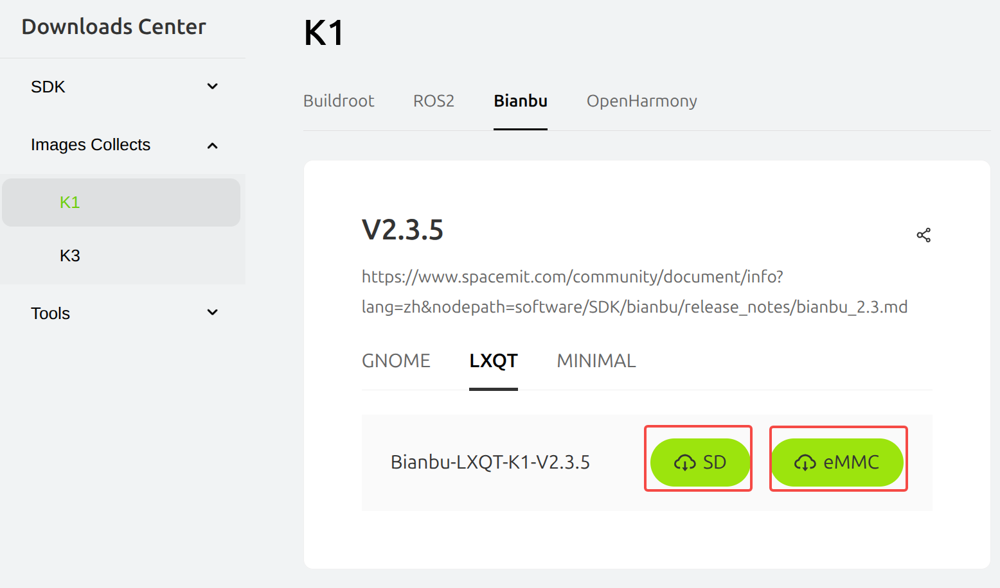

---

### **Stage 2: Issues During Flashing**

After clicking "Start Flashing", if you encounter any of the following issues:

**Issue 1: Clicking "Start Flashing" immediately pops up "Device does not exist"**

Error example

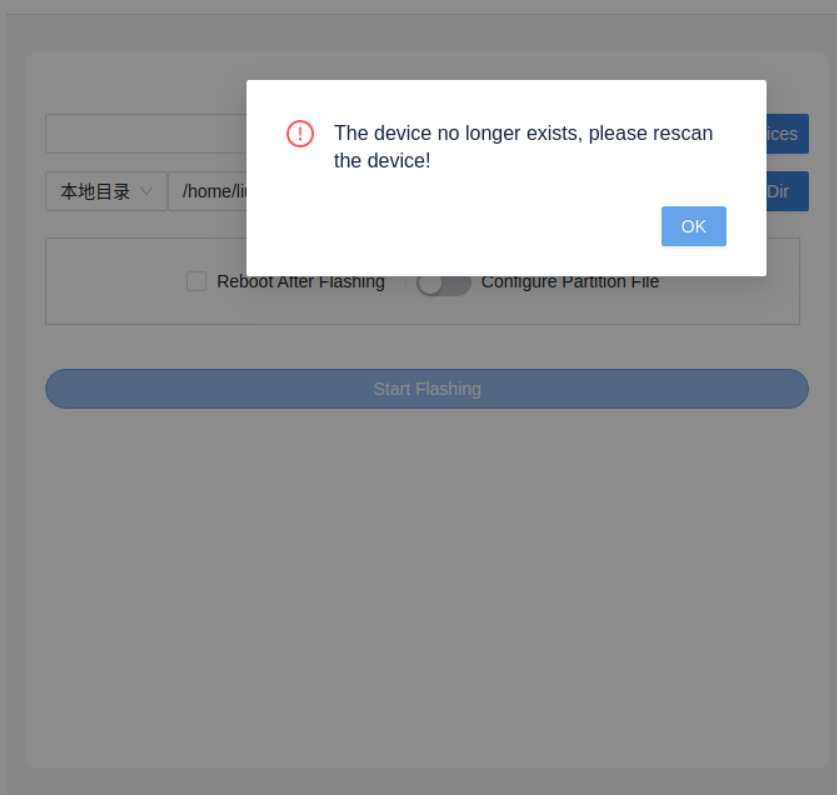

**Cause:** After a successful device scan, the USB data cable became loose or was unplugged, breaking the device connection

**Solution:**
1. Check that the data cable is plugged in firmly
2. [Re-enter flashing mode](#step1-operation-steps)
3. In the Titan tool, click "Refresh Device" or "Scan Device"
4. Once the device is recognized successfully, **avoid touching the data cable** and immediately click "Start Flashing"

**Issue 2: Clicking "Start Flashing" successfully enters flashing but fails immediately**

Error example


**Cause:** After a successful device scan and successfully entering the flashing process, the USB data cable became loose, breaking the device connection

**Solution:**
1. Check that the data cable is plugged in firmly
2. [Re-enter flashing mode](#step1-operation-steps)
3. In the Titan tool, click "Refresh Device" or "Scan Device"
4. Once the device is recognized and flashing has started successfully, **avoid touching the data cable**

**Issue 3: Flashing fails partway through**

Error example

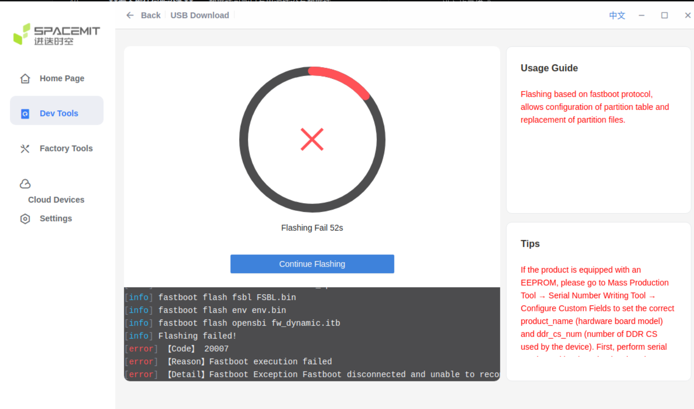

**Cause:** The data cable became loose or made poor contact during flashing

**Solution:** Unplug and reconnect the data cable, making sure both ends are firmly seated

**Issue 4: Clicking flash immediately reports "Flashing failed" with no further details**

Error example


**Cause:** The image file path contains spaces or special characters `()`

**Solution:** Choose a file path without special characters

**Example of an incorrect path:**
- `D:\Program Files (x86)\images\firmware.zip` ← contains spaces and parentheses (special characters)


**Example of a correct path:**

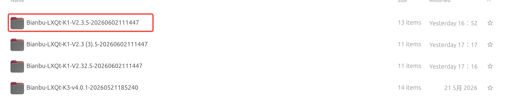

**Successful flashing status**

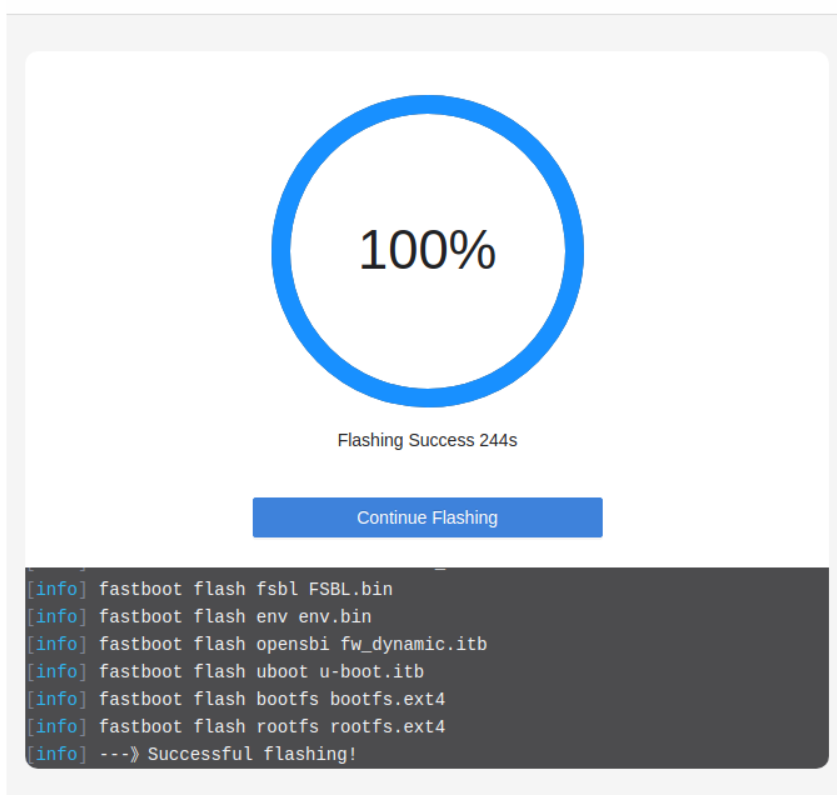

### **Stage 3: Flashing Succeeded but the System Behaves Abnormally**

> **Situation:** If, after a successful flash, you encounter issues such as the USB port not providing power or the MIPI screen showing nothing, the likely cause is an incorrect board model configuration. Please refer to [Step 1: Confirm the board model configuration is correct](#step1-board-model-config) below to troubleshoot.

<a id="step1-board-model-config"></a>
#### Step 1: Confirm the board model configuration is correct

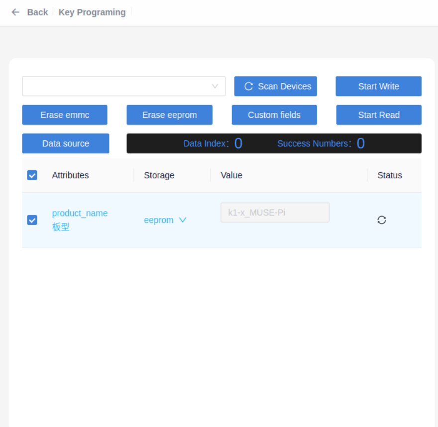

> **Important**: Never configure the board model carelessly

**Example of an error:**
- The board is actually a **MUSE-Pi-Pro**, but **MUSE-Pi** was selected in Titan ← **Incorrect!**

**Consequences of an incorrect board model configuration:**
- USB ports do not provide power
- The MIPI screen shows nothing
- The system may fail to boot
- Some hardware functions may fail

**How to recover from an incorrect board model configuration:**

1. **Re-enter flashing mode**: Follow the [operation steps in Step 1](#step1-operation-steps) to enter flashing mode
2. **Scan the device**, then enter the correct values and select the correct storage medium in the board model configuration tool (if you don't know the correct values or storage medium, ask customer support)

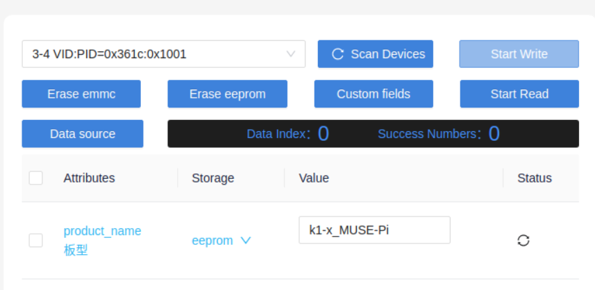

3. **Re-flash the image**
4. **Verify recovery**:
- USB ports provide power
- The MIPI screen displays correctly
- The system boots normally

> **Important**: Do not plug or unplug the USB cable while configuring the board model

**If none of the above works**: This may be a hardware fault — contact customer support on Taobao

---

## Hardware and Power Supply

### Q: How do I choose the right power adapter?

**A:** Choose a power adapter that matches your use case:

- **Basic use** (system boot, light workloads): **5V/2A** is sufficient
- **Full-load operation** (high-performance computing, multiple peripherals at once): a **12V/3A** power adapter is recommended

> **Note**:
> - Powering the board from a computer's USB port (typically only 5V/0.5A~0.9A) may cause the system to become unstable or fail to boot
> - When debugging over a serial connection, it is recommended to use an independent power adapter to avoid system issues caused by insufficient power from the computer's USB port

---


## WiFi Connection

### Q: Does the board need an antenna connected before using WiFi?

**A:** **Yes, an antenna is required.** The WiFi module transmits and receives electromagnetic signals through the antenna. Without an antenna:

- The board may fail to detect any WiFi networks, or detect them with an extremely weak signal
- Even if a connection is established, the speed will be very low and highly unstable, with frequent disconnections

The antenna connector is located on the board and is labeled **ANTENNA**. Simply connect the corresponding external antenna.

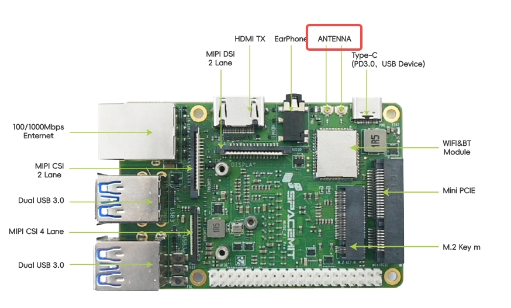

> If you don't have an antenna available, it is recommended to use a **wired network** (Ethernet cable) instead, for better stability.

---
