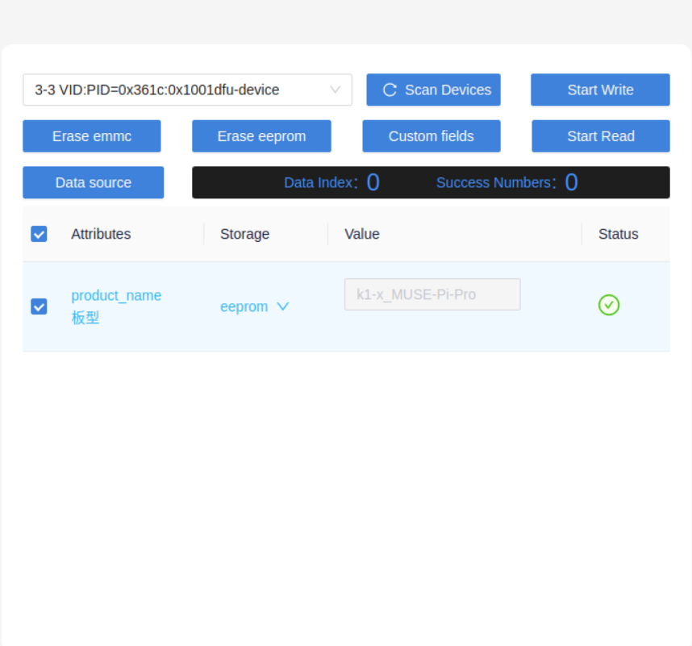
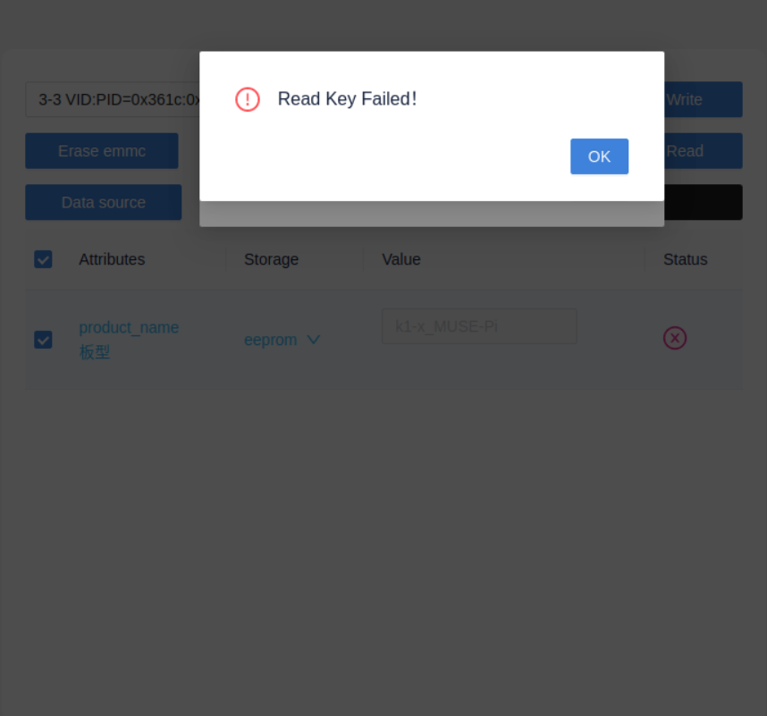
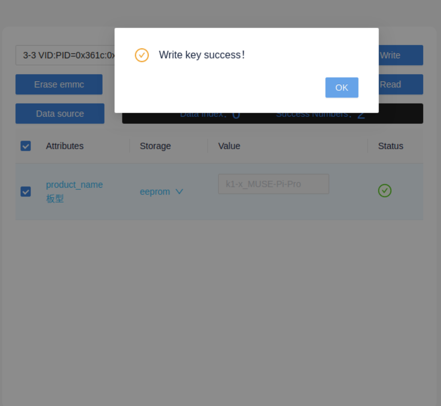
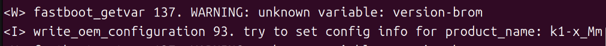

# Frequently Asked Questions (FAQ)

This document summarizes common issues and solutions when using the MUSE Pi Pro development board, covering flashing, power supply, and WiFi connection scenarios.

---

## Hardware

### Q: What power adapter specification should I use?

> **Note**
>
> - A computer's USB port typically only supplies 5V / 0.5A~0.9A, which may cause boot failures or unstable operation.
> - For serial debugging, it is recommended to use an independent power adapter.

Choose based on your actual use case:

| Use Case | Recommended Specification |
| --- | --- |
| System boot, light workloads | 5V / 2A |
| Full-load operation, multiple peripherals | 12V / 3A |

---

## Flashing

### Q: What should I check before starting to flash?

Before starting to flash, make sure:

- You have entered flashing mode.
- Titan can recognize the development board.
- You have downloaded the image that matches the board's storage medium.
- You are using a USB cable that supports data transfer.
- The USB cable is securely connected.

---

### Q: How do I enter flashing mode?

Follow these steps.

When the device is powered off:

1. Press and hold the **FDL** (firmware download) button.
2. Plug in the Type-C cable to connect to the host computer, which powers on the device.
3. Release the **FDL** button.

When the device is already powered on via USB Type-C:

1. Press and hold the **FDL** (firmware download) button.
2. Briefly press the **RST** (reset) button.
3. Release the **FDL** button.


---

### Q: How do I confirm that flashing mode was entered successfully?

You can verify using either of the following methods.

**Titan (recommended)**

Open Titan and click **Refresh Device** or **Scan Device**.

If a device serial number or "Connected" status is shown, flashing mode was entered successfully.


**Linux**

Run:

```bash
lsusb
```

If you see:

```text
DFU USB download gadget
```

flashing mode was entered successfully.


> **Windows users**
>
> Windows has no `lsusb` command, and Device Manager may not correctly show the device due to driver issues.
>
> It is recommended to use Titan directly to check whether the device is recognized.

---

### Q: What should I do if Titan cannot recognize the device?

If Titan cannot scan the device:


Check the following in order:

1. Re-enter flashing mode.
2. Switch to a different USB port on the computer (a port connected directly to the motherboard is recommended).
3. Switch to a different USB cable that supports data transfer.
4. If it still cannot be recognized, contact customer support.

---

### Q: How do I choose the correct image?

MUSE Pi Pro supports two storage mediums:

| Storage Type | Image to Use |
| --- | --- |
| eMMC (default) | eMMC image |
| Micro SD card | `.img` image |

You can confirm this by:

- Checking the label on the back of the board or the product manual.
- Checking whether an SD card is inserted.
- If unsure, choose the **eMMC image** by default.

Download URL:

<https://www.spacemit.com/community/resources-download/Images%20Collects/K1/Bianbu>


---

### Q: After clicking "Start Flashing," it shows "Device does not exist." What should I do?

**Cause**

The USB connection was disconnected, usually because:

- The USB cable is loose.
- The USB cable was unplugged.
- The board exited flashing mode.


**Solution**

1. Check that the USB cable is securely connected.
2. Re-enter flashing mode.
3. In Titan, click **Refresh Device** or **Scan Device**.
4. Once the device is recognized, start flashing immediately and avoid touching the USB cable.

---

### Q: What should I do if flashing fails immediately after clicking "Start Flashing"?

**Cause**

The USB connection was interrupted right after flashing started.


**Solution**

- Check that the USB cable is securely connected.
- Re-enter flashing mode.
- Re-scan the device.
- Avoid moving the board or the USB cable during flashing.

---

### Q: What should I do if flashing fails partway through with a write error?

**Cause**

Poor USB contact.


**Solution**

Unplug and reconnect the USB cable, making sure both ends are securely connected.

---

### Q: What should I do if flashing fails with no detailed error message?

**Cause**

The image file path contains spaces or special characters, such as:

- Spaces
- `(`
- `)`

Incorrect example:

```text
D:\Program Files (x86)\images\firmware.zip
```


**Solution**

Move the image to a directory without spaces or special characters, then select it again.

Correct example:


---

### Q: After flashing succeeds, the USB port has no power, the MIPI screen shows nothing, or the system behaves abnormally. What should I do?

If any of the following issues occur after a successful flash:

- The USB port does not provide power.
- The MIPI screen shows nothing.
- The system fails to boot normally.
- Some hardware functions behave abnormally.

This is usually caused by an incorrect board model configuration.

Incorrect example:

The board's actual model is **MUSE-Pi-Pro**, but **MUSE-Pi** was selected during configuration.


> **Note**
>
> Configuring the board model is not recommended unless necessary.

---

### Q: How do I recover from an incorrect board model configuration?

**Step 1: Re-enter flashing mode**

Refer to the earlier section "How do I enter flashing mode?"

**Step 2: Read the device information**

In Titan, click **Read**.

Titan interface successful read example:



Serial communication interface successful read example:


If reading fails on Linux:



This is usually due to insufficient USB permissions.

Run:

```bash
cd ~/path-to-titan-tool
sudo ./titantools_for_linux-2.2.0-Rc.AppImage --no-sandbox
```

Restart Titan and read again.

**Step 3: Write the device information**

Fill in the correct:

- Board model.
- Storage medium.

If unsure, contact customer support.

Titan interface successful write example:



Serial communication interface successful write example:



> **Note**
>
> Do not plug or unplug the USB cable while reading or writing device information.

**Step 4: Verify the recovery**

Confirm that the following functions have returned to normal:

- The USB port provides power normally.
- The MIPI screen displays correctly.
- The system boots normally.

If the issue persists, contact customer support.

---

## WiFi

### Q: Is an antenna required before using WiFi?

**Yes, it is required.**

Without an antenna connected, you may experience:

- Inability to detect any WiFi networks.
- Extremely weak WiFi signal.
- Unstable connections.
- Frequent disconnections.

The antenna connector is located at the **ANTENNA** label on the board.


If you don't have an antenna available, it is recommended to use a wired network connection instead.
