# 常见问题解答（FAQ）

本文档记录使用 MUSE Pi Pro 开发板进行远程连接时的常见问题及解决方法。
---

## 烧录问题

### Q: 无法烧录或者烧录失败，怎么办？

**A:** 烧录问题需要分阶段排查，按以下顺序检查：

---

### **阶段一：烧录前准备工作**

在点击"开始烧录"按钮前，确保以下准备工作已完成：

**Step1: 开发板进入烧录模式并连接电脑**

<a id="step1-操作步骤"></a>
**操作步骤：**
1. 长按 **FDL** 按键（不要松开）
2. 同时短按 **RST**（复位）按键（绿灯将会闪烁一次）
3. 松开 FDL
4. 用数据线连接开发板和电脑

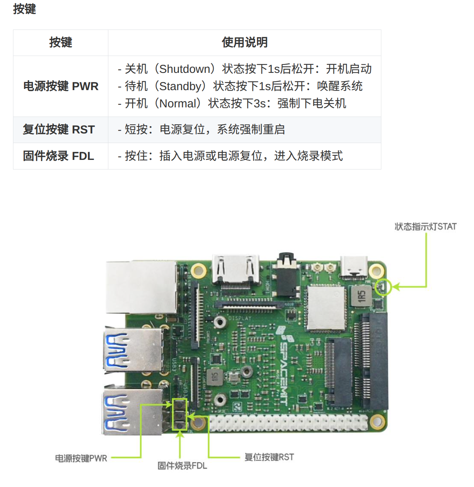


**验证是否成功进入烧录模式：**

用以下任一方法验证：

**方法一：使用 Titan 工具（推荐，最直接，Windows/Linux 通用）**
- 打开 Titan 工具，点击"刷新设备"或"扫描设备"
- 能识别到设备（显示设备序列号或"已连接"状态） → 成功

下方为扫描设备成功示例图（扫描设备有值）


**方法二：使用系统命令验证**

**Linux 系统：**
```bash
lsusb 
```
- 能看到 `DFU USB download gadget` → 成功


> **Windows 用户说明**：Windows 不像 Linux 有 `lsusb` 命令，设备管理器也可能因驱动问题看不到设备。**推荐直接使用方法一（Titan 工具）验证**，只要 Titan 能识别到设备就说明成功进入烧录模式，可以正常烧录。


**如果无法识别到设备，按以下顺序排查：**

下方为扫描设备失败示例图（扫描设备为空）


1. **重新进入烧录模式**：重复[上述操作步骤](#step1-操作步骤)（长按 FDL + 短按 RST）

2. **更换电脑 USB 接口**：优先使用主板直连的 USB 口，避免使用 USB Hub 或扩展坞

3. **更换数据线**：使用**确认可以传输数据的数据线**（例如能连接手机进行文件传输的线）重试

4. **如果以上方法都无效**：可能是硬件故障，联系客服

**Step2: 确认下载的镜像类型与开发板存储类型匹配**

开发板有两种存储方式：
- **eMMC**：板载闪存（芯片焊在板子上，不可拆卸）→ **MUSE Pi Pro 标准配置使用 eMMC**
- **SD 卡**：插入的 Micro SD 卡（可拆卸，插在开发板的 SD 卡槽中）

**如何判断自己的开发板用的是哪种存储？**

> **说明：** 下载的镜像文件名包含 `.img` 扩展名的为 SD 卡镜像；其他镜像文件的为 eMMC 镜像。

1. **查看开发板背面或产品说明书**，通常会标注存储类型
2. **看开发板是否插了 SD 卡**：
   - 如果 SD 卡槽是空的 → 用的是 eMMC
   - 如果插了 SD 卡 → 可能用的是 SD 卡存储
3. **如果不确定**：MUSE Pi Pro 开发板默认使用 **eMMC**，优先尝试下载 eMMC 镜像

**下载地址：**  
https://www.spacemit.com/community/resources-download/Images%20Collects/K1/Bianbu

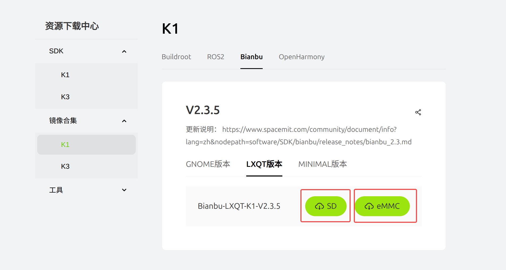


---

### **阶段二：烧录时遇到的问题**

点击"开始烧录"后，如果出现以下问题：

**问题1: 点击"开始烧录"立即弹窗提示"设备不存在"**

报错示例

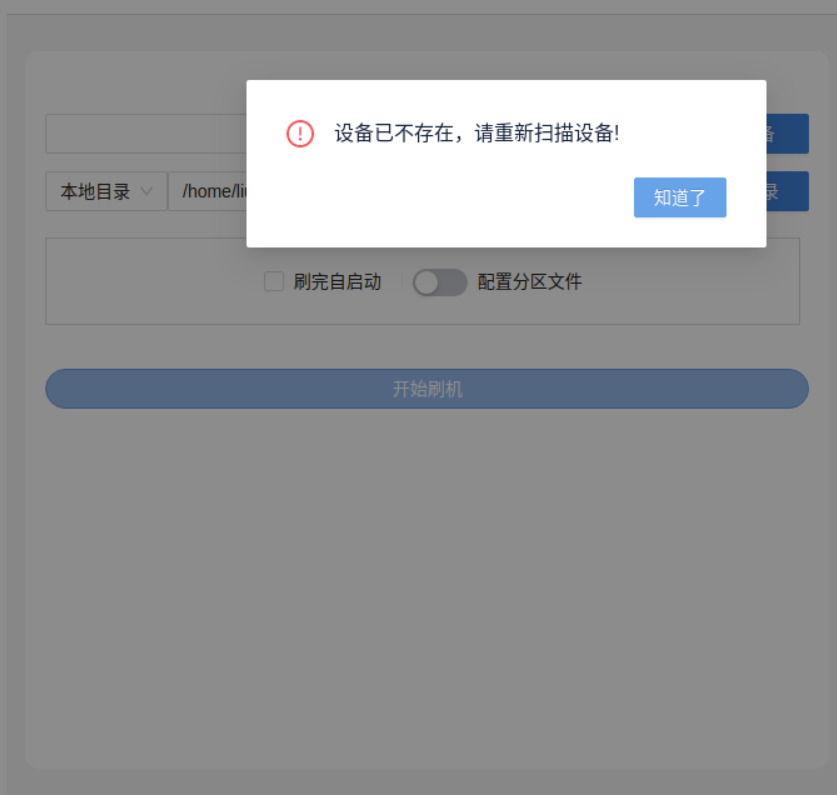
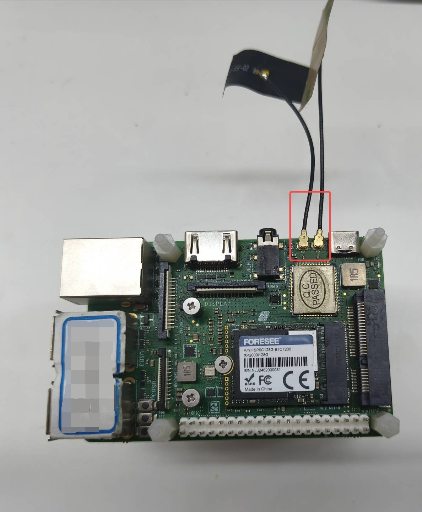

**原因：** 扫描设备成功后，USB 数据线松动或被拔出，导致设备连接断开

**解决方法：** 
1. 检查数据线是否插紧
2. [重新进入烧录模式](#step1-操作步骤)
3. 在 Titan 工具中点击"刷新设备"或"扫描设备"
4. 确认设备识别成功后，**避免触碰数据线**，立即点击"开始烧录"

**问题2: 点击"开始烧录"成功进入烧录但立马失败**

报错示例

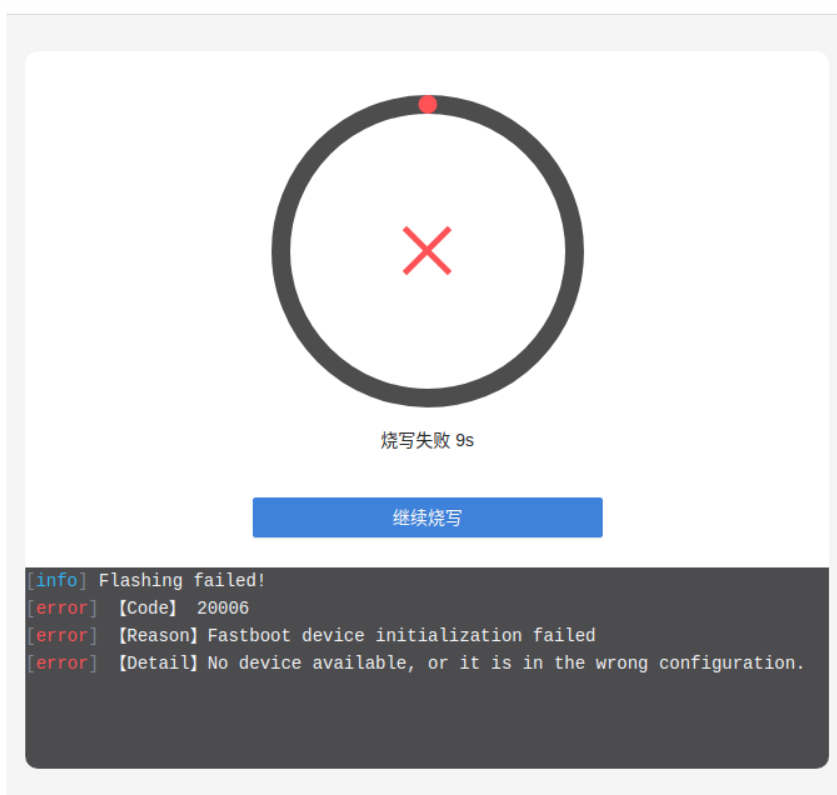


**原因：** 扫描设备成功并点击进入烧录成功后，USB 数据线松动，导致设备连接断开

**解决方法：** 
1. 检查数据线是否插紧
2. [重新进入烧录模式](#step1-操作步骤)
3. 在 Titan 工具中点击"刷新设备"或"扫描设备"
4. 确认设备识别成功并成功进入烧录后，**避免触碰数据线**，

**问题3: 烧录过程中出现烧写失败**

报错示例

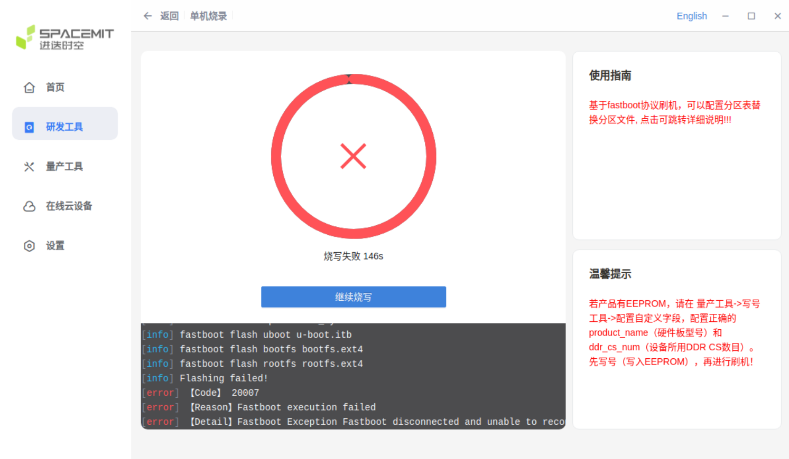


**原因：** 烧录时数据线松动或接触不良

**解决方法：** 重新拔插数据线，确保两端都插紧

**问题4: 点击烧录立即报"烧写失败"，无任何详细信息**

报错示例

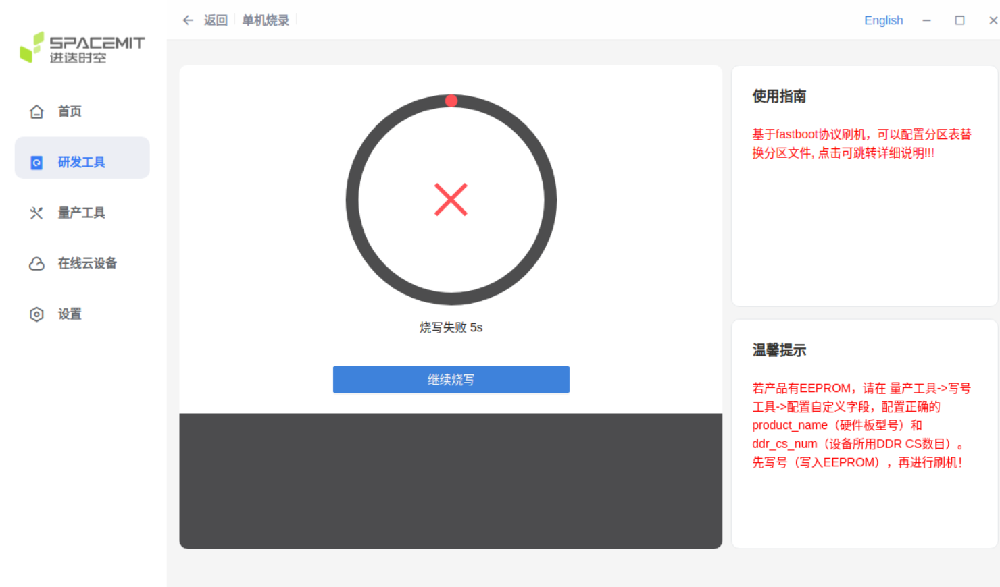
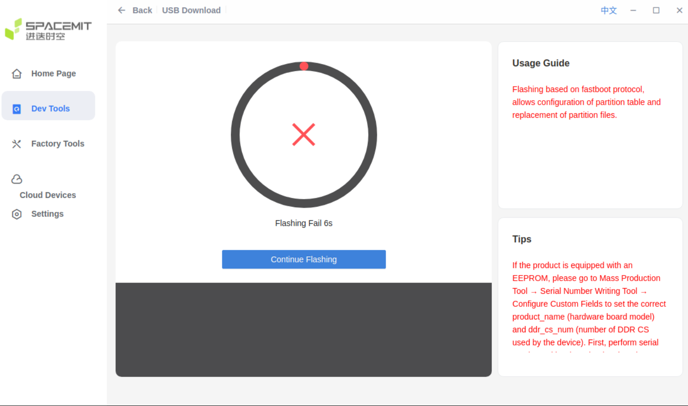

**原因：** 镜像文件路径包含空格或特殊字符 `()`

**解决方法：** 选择不包含特殊字符的正确路径的文件

**错误路径示例：**
- `D:\Program Files (x86)\images\firmware.zip` ← 包含空格和括号等特殊字符

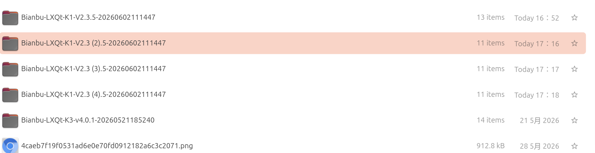

**正确路径示例：**


**烧写成功状态**


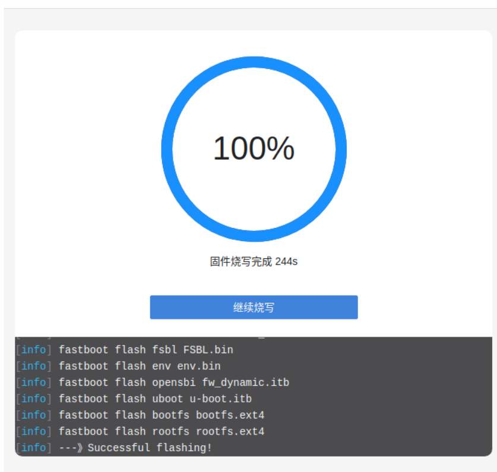

### **阶段三：烧录成功但系统异常**

> **情况说明：** 若烧录成功后遇到 USB 接口不供电、MIPI 屏幕无显示等问题，可能原因是写号配置错误。请参考下方 [Step1: 确认开发板型号配置正确](#step1-写号配置) 进行排查。

<a id="step1-写号配置"></a>
**Step1: 确认开发板型号配置正确**

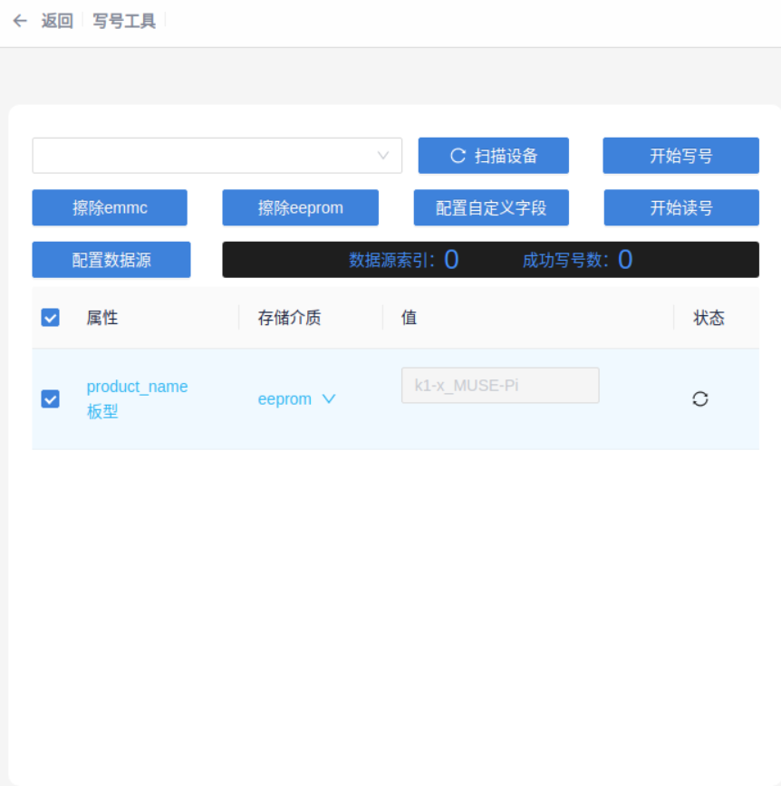


> **重要提示**：切勿随意进行写号

**错误示例：**
- 开发板实际是 **MUSE-Pi-Pro**，却在 Titan 中选择了 **MUSE-Pi** ← **错误！**

**随意写号的后果：**
- USB 接口不供电
- MIPI 屏幕无显示
- 系统可能无法启动
- 部分硬件功能失效

**若已经写号错误，如何恢复？**

1. **重新进入烧录模式**：[按照 Step1 操作步骤](#step1-操作步骤)进入烧录模式
2. **扫描设备**在写号工具当中填写正确的值并选择正确的存储介质（若不知道具体的值与存储介质，可询问客服）

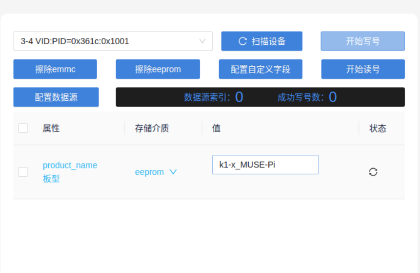
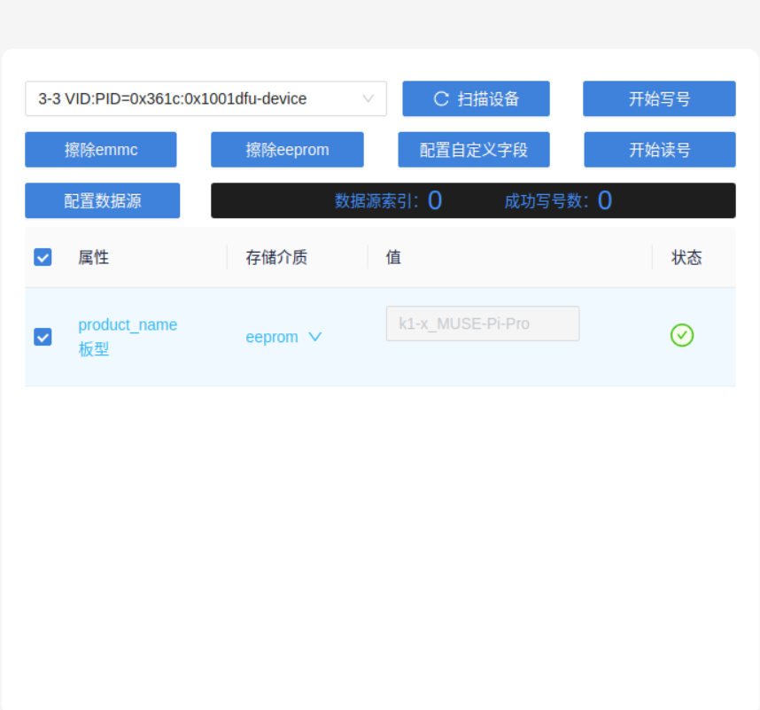


3. **重新烧录镜像**
4. **验证恢复**：
- USB 接口供电
- MIPI 屏幕显示
- 系统正常启动

> **重要提示**：写号时请勿插拔usb线

**如果以上方法都无效**：可能是硬件故障，联系淘宝客服

---

## 硬件与供电

### Q: 如何选择电源型号？

**A:** 根据使用场景选择合适的电源规格：

- **基础使用**（系统启动、轻量任务）：**5V/2A** 即可满足需求
- **满负荷运行**（高性能计算、多外设同时工作）：推荐使用 **12V/3A** 电源适配器

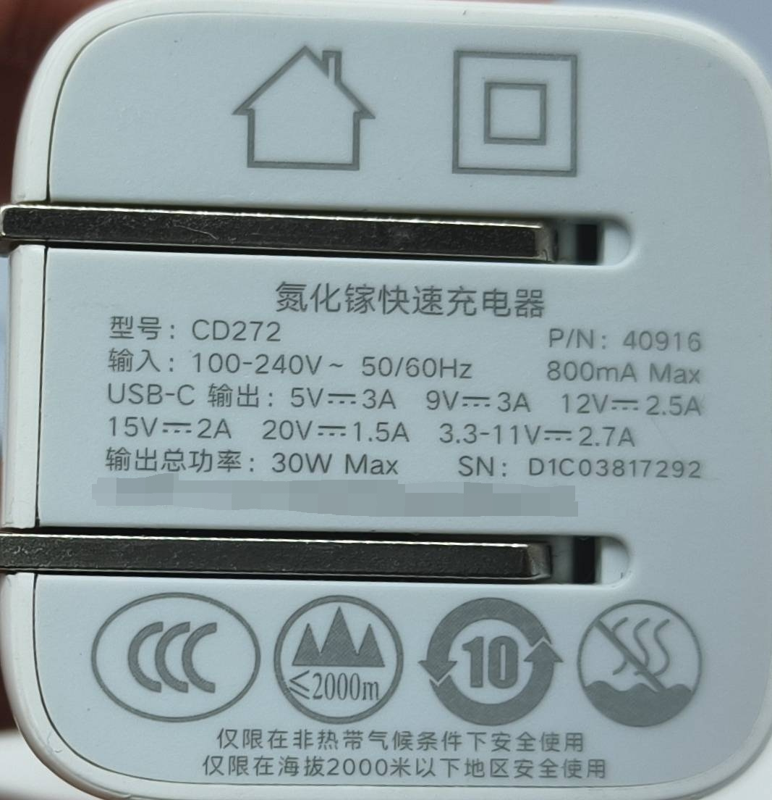

> **注意**：
> - 使用电脑 USB 口供电（通常仅 5V/0.5A~0.9A）可能导致系统不稳定或无法启动
> - 进行串口通信调试时，建议使用独立电源适配器供电，避免因电脑 USB 口供电不足导致系统异常

---


## WiFi 连接

### Q: 使用 WiFi 前需要接天线吗？

**A:** **必须连接天线。** WiFi 模块通过天线发射和接收电磁波信号。不接天线的后果：

- 无法搜索到 WiFi 网络，或搜到但信号极弱
- 即使勉强连接，速率极低且极不稳定，频繁断连

天线接口位于开发板上，标有 **ANTENNA** 字样，连接对应的外置天线即可。


> 如果暂无天线，推荐改用**有线网络**（网线连接）替代，稳定性更好。

---
