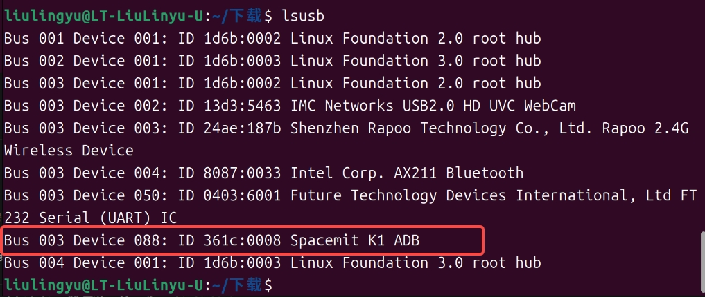
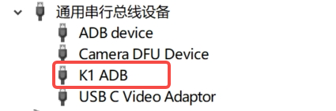

# 常见问题解答（FAQ）

本文档记录使用 MUSE Pi Pro 开发板进行远程连接时的常见问题及解决方法。
---

## 烧录问题

### Q: 无法烧录或者烧录失败，怎么办？

**A:** 按以下顺序排查：

**Step1:** 开发板没进入烧录模式，可长按固件烧录FDL，然后短按复位按键RST，进入烧录模式。


**Step2:** 检查数据线是否支持数据传输（排除纯充电线）

**如何判断数据线是否支持数据传输？**

最可靠的方法是**直接用这根线测试开发板连接**：

1. 让开发板进入烧录模式（长按 FDL，短按 RST）
2. 用要测试的数据线连接开发板和电脑
3. 在电脑终端执行：

**Linux终端：**
```bash
lsusb
```


**Windows：**
打开"设备管理器"，查看"通用串行总线设备"或"其他设备"




**判断结果：**
-  **能看到 K1设备** → 数据线支持数据传输，可以尝试烧录
-  **看不到任何新设备** → 数据线可能只有电源线没有数据线，或未正确进入烧录模式

> **重要提示：**
> - 即使能识别设备，也不能 100% 保证烧录成功
> - 数据线可能在长时间传输（烧录 8GB 镜像）时出现接触不良、传输错误
> - 如果烧录过程中频繁失败，建议更换数据线重试

**Step3:** 可能下载错误的文件，应该下载eMMC镜像文件，网址：https://www.spacemit.com/community/resources-download/Images%20Collects/K1/Bianbu


**Step4:** 使用了带空格或()路径的文件，会导致一进行烧录就报烧写失败错误，且无任何信息，需要重新选择不带特殊字符路径的文件。


**Step5:** 烧录过程中，出现红色报错，可能是烧录时数据线松动，需要重新拔插数据线识别设备进行烧录。


**Step6:** 请不要随意写号（比如把MUSE-Pi-Pro写号成MUSE-Pi,这会导致USB不供电，MIPI屏幕没有显示，甚至系统可能无法启动）


---

## 硬件与供电

### Q: 如何选择电源型号？

**A:** 根据使用场景选择合适的电源规格：

- **基础使用**（系统启动、轻量任务）：**5V/2A** 即可满足需求
- **满负荷运行**（高性能计算、多外设同时工作）：推荐使用 **12V/3A** 电源适配器


> **注意**：
> - 使用电脑 USB 口供电（通常仅 5V/0.5A~0.9A）可能导致系统不稳定或无法启动
> - 进行串口通信调试时，建议使用独立电源适配器供电，避免因电脑 USB 口供电不足导致系统异常

---


## WiFi 连接

### Q: 使用 WiFi 前需要接天线吗？

**A:** **必须连接天线。** WiFi 模块通过天线发射和接收电磁波信号。不接天线的后果：

- 无法搜索到 WiFi 网络，或搜到但信号极弱
- 即使勉强连接，速率极低且极不稳定，频繁断连

天线接口位于开发板上，标有 **ANTENNA** 字样，连接对应的外置天线即可。


> 如果暂无天线，推荐改用**有线网络**（网线连接）替代，稳定性更好。

---
